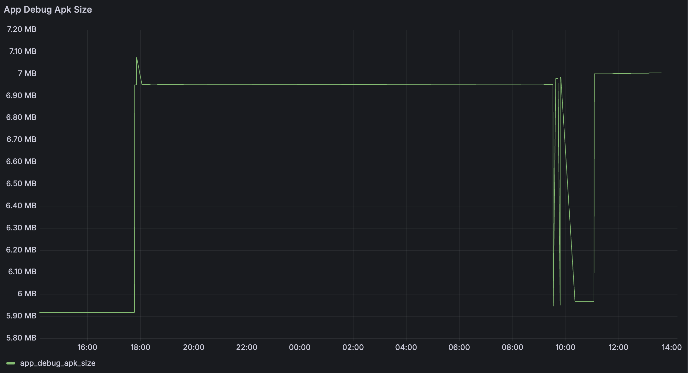

# Android Artifacts Size Report

**Android Artifacts Size Report** is a Gradle plugin that enhances [Build Scans](https://scans.gradle.com/) by adding custom values to report the sizes of key artifacts in your Android project.
The plugin supports the following artifact types:
- **APK**
- **AAR**
- **AAB**

## Usage
```kotlin
plugins {
  id("io.github.cdsap.android-artifacts-size-report") version "0.1.1"
}
```
After the build is finished, the plugin will add custom values to the build scan with the size of the artifacts from the projects
where the plugin is applied:


## Implementation
If the project where the plugin is applied contains an Android Application or Android Library it will automatically register a task for the current variants.
This task will be executed once the final version of the artifact type has been produced using the Android Gradle Plugin Artifact API.
For instance, for AARs:
```kotlin
val getAar = tasks.register<SizeFileTask>("sizeAar${variant.name}") {
...
}

variant.artifacts.use(getAar).wiredWith { it.input }.toListenTo(SingleArtifact.AAR)

```

## Reporting
Storing this information in the build scan allows you to create reports with the information of the size of the artifacts.
### Develocity API
The [Develocity API](https://docs.gradle.com/develocity/api-manual/ref/2024.3.html) provides the model `gradleAttributes`
containing the custom values added by the plugin.
In this example, we are requesting the apk size of the last 100 builds:
```shell
curl --location -G 'https://$DV_URL/api/builds?models=gradle-attributes&reverse=true&maxBuilds=100' \
      --header "Authorization: Bearer $DV_TOKEN" | \
        jq -r '[.[] | .models.gradleAttributes.model.values[]
          | select(.name | test("\\.apk\\.size$"))
          | .value] | .[]'
```

Output:
```text
7000096
7000096
7000096
7000096
7000096
7000096
6999796
6999796
6999796
6999796
6999796
6999796
6999796
6999796
5966391
5966391
5966391
4519041
```

### DRK
If you have integrated [Developer Report Kit](https://gradle.com/develocity/product/reporting-and-visualization/) you can
query the avaliable build models and create custom visualization components.
#### Time Series APK Debug size
```sql
SELECT
    from_unixtime(gradleattributes.buildstarttime / 1000) AS time,
    CAST(app_debug_size.value AS DOUBLE) AS app_debug_apk_size
FROM build
CROSS JOIN UNNEST(gradleattributes."values") AS app_debug_size (name, value)
WHERE app_debug_size.name = 'app-debug.apk.size'
```



#### Release AAR size by module
```sql
SELECT
    REGEXP_REPLACE(SUBSTR(app_debug_size.name, 1, POSITION('-release.aar.size' IN app_debug_size.name) - 1), '-prod$', '') AS module,
    CAST(app_debug_size.value AS DOUBLE) AS release_aar_size
FROM build
CROSS JOIN UNNEST(gradleattributes."values") AS app_debug_size (name, value)
WHERE app_debug_size.name LIKE '%-release.aar.size'
  AND app_debug_size.name LIKE '%-prod-release.aar.size'

```

